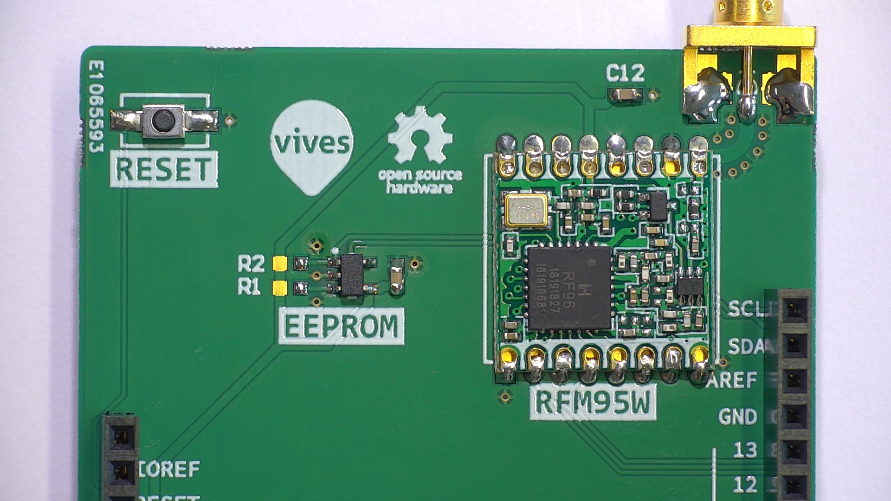
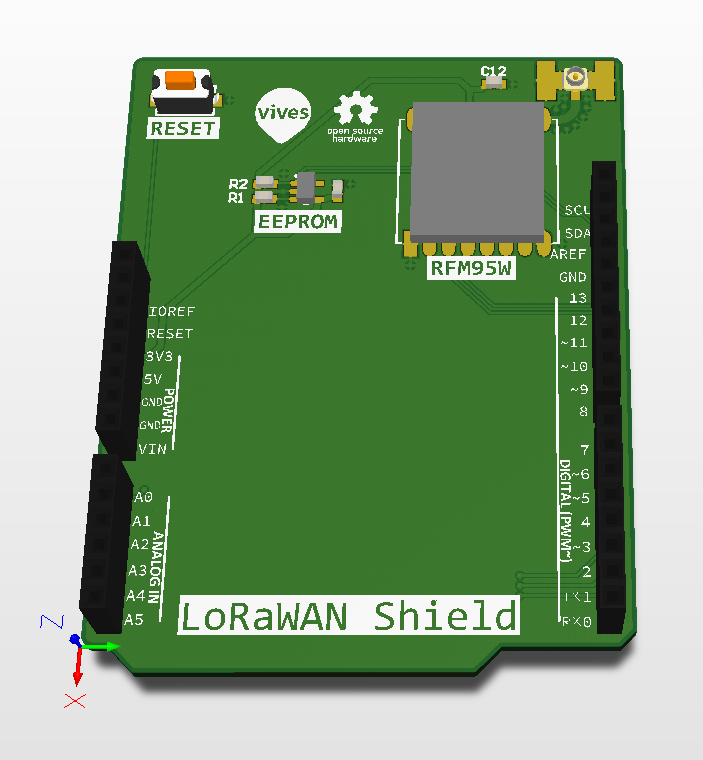
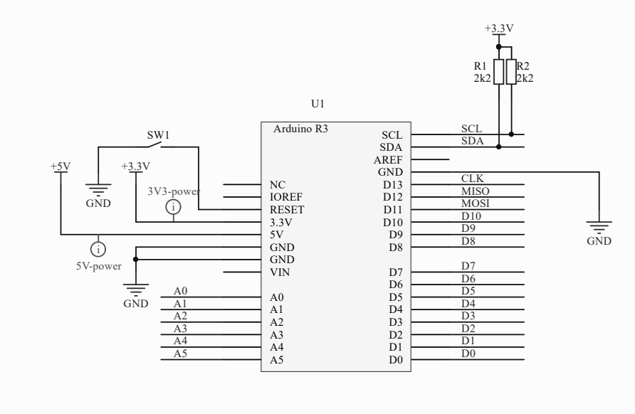
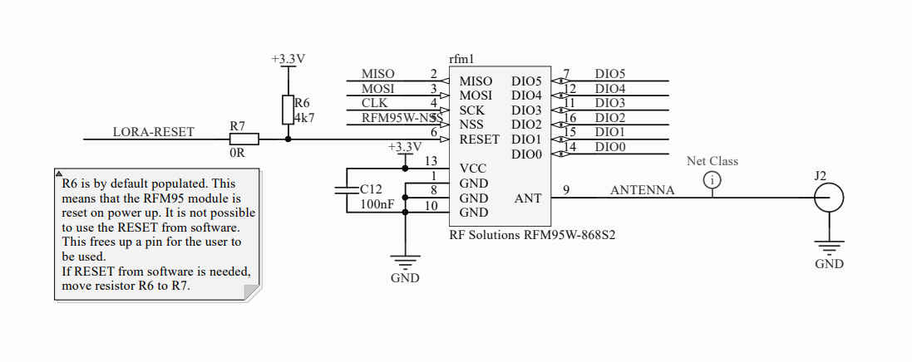
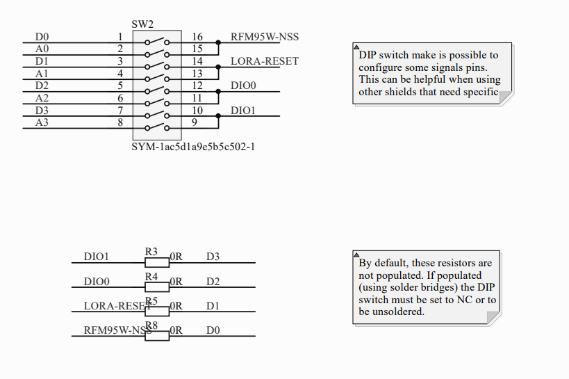
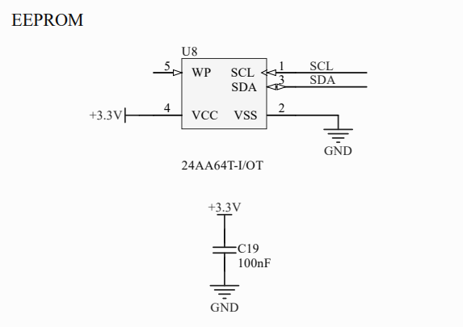
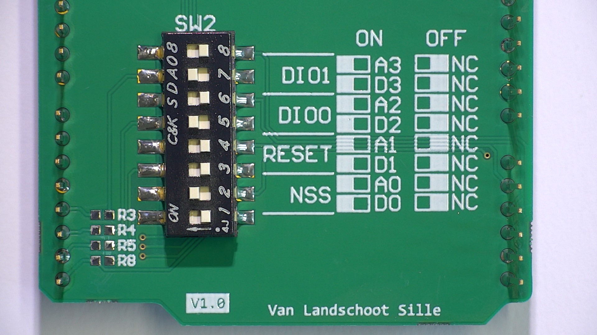
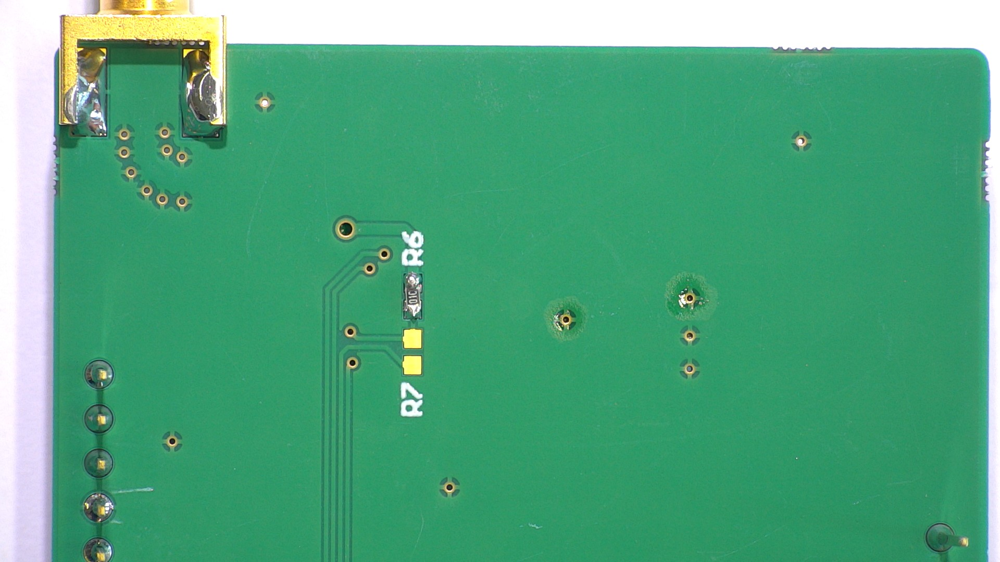

# LoRaWAN Shield example

This project is a 'Hello World' application for the LoRaWAN Shield, developed at VIVES. This example makes use of the [Simple LoRaWAN](https://github.com/sillevl/mbed-Simple-LoRaWAN) library for Mbed and the [LoRaWAN Serialization](https://github.com/sillevl/mbed-lorawan-serialization) library.



This example will send a single byte every 30 seconds. After each transmit, the counter is incremented by 1.

## Getting started

Clone the project, and install library dependencies.

```shell
git clone git@github.com:sillevl/lorawan-shield-example.git
cd lorawan-shield-example
mbed deploy
```

Next setup your LoRaWAN security keys in `src/settings.h`.

You can now compile and run the application on your embedded board using:

```shell
mbed compile -f
```

Open your favorite serial terminal application and connect to the serial device.

## Settings

You can change the LoRaWAN keys and the used device pin names in the `src/settings.h` file. By default, this file is not present. Copy/paste the `settings.example.h` file in the `src/` directory, and edit the settings accordingly.

```cpp
LoRaWANKeys keys = {
    { 0x00, 0x00, 0x00, 0x00, 0x00, 0x00, 0x00, 0x00 },         // devEui
    { 0x00, 0x00, 0x00, 0x00, 0x00, 0x00, 0x00, 0x00 },         // appEui
    { 0x00, 0x00, 0x00, 0x00, 0x00, 0x00, 0x00, 0x00, 0x00, 0x00, 0x00, 0x00, 0x00, 0x00, 0x00, 0x00 } // appKey
};
```

```cpp
Pinmapping pins = { D11, D12, D13, A0, A1, D2, D3 };  // mosi, miso, clk, nss, reset, dio0, dio1
```

## LoRaWAN Shield

The LoRaWAN Shield, developed at VIVES. Is an Arduino compatible board that houses an RFM95W LoRaWAN transceiver and a small EEPROM. The shield can be used on every Mbed board that has an Arduino compatible header layout.



### Schematic

The full schematic can be found in [`docs/schematic.pdf`](docs/schematic.pdf)

#### Shield

The shield uses the Arduino shield specification and can be stacked with other shields for expansion. Most pins are free to use by the user. Some pins are needed for the communication with the LoRaWAN transceiver. The board supports several pin configuration options improving compatibility with different microcontroller boards and stacked shields.



#### LoRaWAN Transceiver

The LoRaWAN shield uses a RFM95 transceiver for LoRaWAN communication. The RFM95 uses SPI.



#### Pin configuration

Some pins are configurable using solder bridges or DIP switches to improve compatibility with different microcontroller boards and shields.



#### EEPROM

A 64kbit EEPROM is available on the shield for storing some information or settings.



### Pin Mapping

The LoRaWAN Shield uses some fixed pins for SPI, together with some configurable DIP switches at the back of the shield to configure a different mapping. This feature is available to be compatible with different microcontroller boards and other sensor shields.

Signal | Pin | configurable
--- | --- | ---
MOSI | D11 | no
MISO | D12 | no
CLK | D13 | no
NSS | D0 or A0 | yes, using DIP switch / solder bridge
RESET | D1 or A1 | yes, using DIP switch / solder bridge
DIO 0 | D2 or A2 | yes, using DIP switch / solder bridge
DIO 1 | D3 or A3 | yes, using DIP switch / solder bridge



#### Default pinmap

This example uses the following pinmapping by default:

Signal | Default pin
--- | ---
MOSI | D11
MISO | D12
CLK | D13
NSS | A0
RESET | NC (if R6 pull-up resistor)
DIO 0 | D2
DIO 1 | D3

You are able to adjust this pinmapping in the `src/settings.h` file. Don't forget to adjust the DIP switches accordingly.

#### Pins DO and D1

Some microcontroller boards like ST Nucleo have hardwired serial connections for the USB UART on the pins D0 and D1. Therefore it is impossible to combine UART communications over USB and the LoRaWAN Shield using D0 and D1. Use the DIP switches to change the configuration and use A0 and A1.

#### RFM95 RESET

By default the shield comes with a pull-up resistor R6 enabling a fixed RESET signal for the RFM95. If it is necessary that the RFM95 module needs to be able to be reset from software, R7 needs to be soldered (solder bridge or 0R resistor). This connects the RESET signal pin to the DIP switch or solder bridge R5. RESET can now be used from within software.



### Microcontroller RESET

A reset button is provided to reset the microcontroller.

## Dependencies

### Simple LoRaWAN library

Note: This library is still in development

[https://github.com/sillevl/mbed-Simple-LoRaWAN](https://github.com/sillevl/mbed-Simple-LoRaWAN)

### LoRaWAN Serialization library

Note: This library is still in development

[https://github.com/sillevl/mbed-lorawan-serialization](https://github.com/sillevl/mbed-lorawan-serialization)

## Hardware

The source files for the hardware can be found on [Circuitmaker](https://workspace.circuitmaker.com/Projects/Details/Sille-Van-Landschoot-2/LoRaWAN-Shield-Lite).
